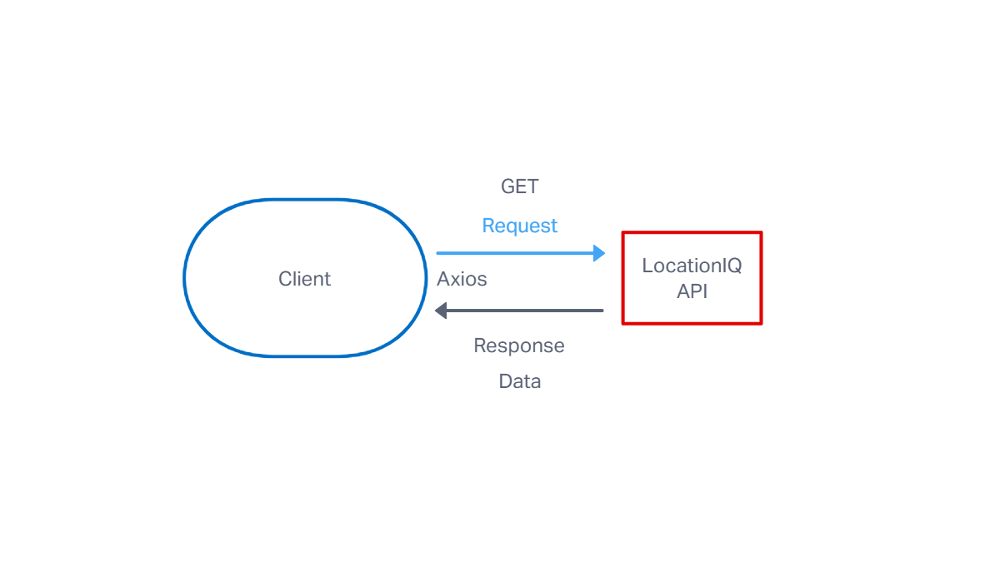
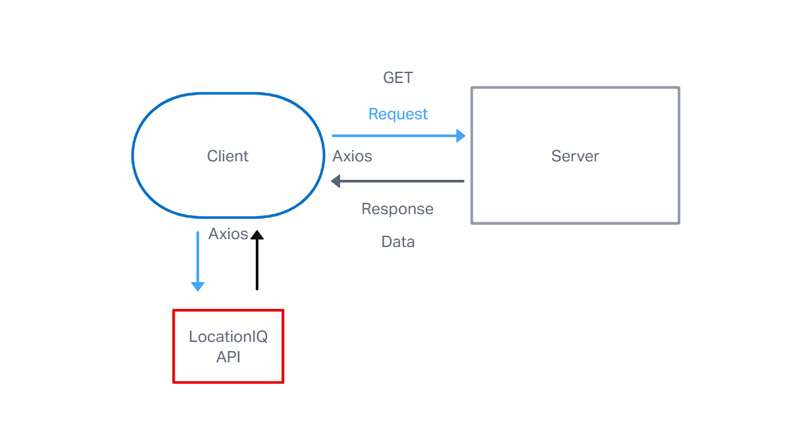
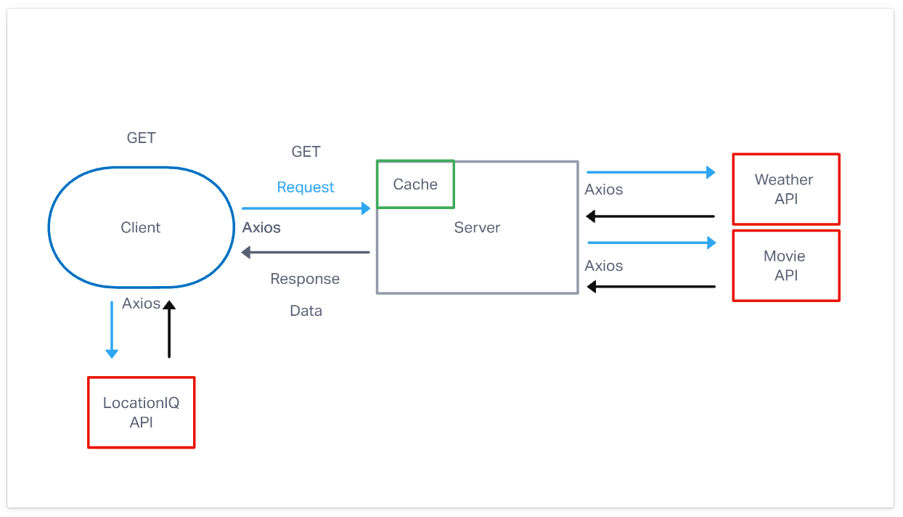

# City Explorer API

**Author**: Cianenry Danan
**Version**: 1.0.3 (increment the patch/fix version number if you make more commits past your first submission)

## Overview
<!-- Provide a high level overview of what this application is and why you are building it, beyond the fact that it's an assignment for this class. (i.e. What's your problem domain?) -->
This server sends weather data and movie data to the client using REST then saves the data into a cache.

## Getting Started
<!-- What are the steps that a user must take in order to build this app on their own machine and get it running? -->
1. Create a repo and run npm init.
2. Install express dotenv and cors with npm install express dotenv cors
3. Create the Express server

## Architecture

* Node.js
* Express
* Cors
* JavaScript

## Change Log
<!-- Use this area to document the iterative changes made to your application as each feature is successfully implemented. Use time stamps. Here's an example:-->

9-28-2022 10:28am - Application now has a fully-functional express server, with a GET route for the location resource.

9-29-2022 8:44pm - Application now connects to both weather and movie data bases.

9-30-2022 12.26am - Moved getWeather and getMovies functionality into modules.

9-30-2022 11:10pm - 

## Credit and Collaborations
<!-- Give credit (and a link) to other people or resources that helped you build this application. -->

### Name of feature: Display weather data

Estimate of time needed to complete: 4 hours

Start time: 3:30 PM

Stop time: 10:00 PM

time: 6.5 hours

Start time: 7:00 AM

Finish time: 10:28 AM

Actual time needed to complete: 10 hours.

### Name of feature: Populate weather forecast with accurate information

Estimate of time needed to complete: 4 hours

Start time: 2:15 pm

Finish time: 10:00 pm

Actual time needed to complete: 8 hours 15 minutes.

### Name of feature: Add movie info after a city search

Estimate of time needed to complete: 4 hours

Start time: 1:10 pm

Finish time: 8:30 pm

Actual time needed to complete: 7 hours 20 minutes.

### Name of feature: Add modules

Estimate of time needed to complete: 2 hours

Start time: 11:32pm

Finish time: 12:23am

Actual time needed to complete: 1 hour 9 minutes.

### Name of feature: Create a cache to store data

Estimate of time needed to complete: 1 hour

Start time: 10:31 PM

Finish time: 11:10 PM

Actual time needed to complete: 49 minutes

